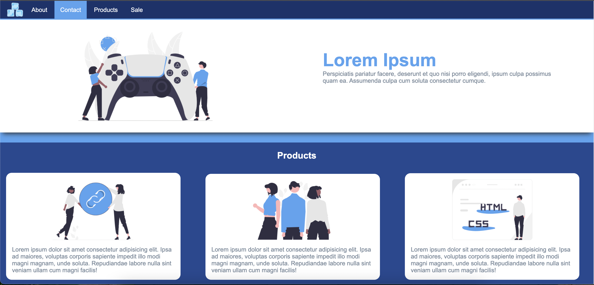

<h2>HTML Web Page Code</h2>
This repository contains the code for an HTML web page based on a provided design. The <code>images</code> folder includes all the assets needed for the webpage. The page includes a favicon and uses semantic markup.

The background color of the page is created using a linear gradient. The menu links have a background of <code>#54a4f1</code> on hover. Hovering on "product" displays a dropdown menu. The product section uses the <code>display</code> property to stack the boxes next to each other, without using positioning for layout purposes.

The code only uses the techniques covered so far, making it a great starting point for learning HTML and CSS.

Feel free to use this code as a starting point for your own web page project!

## Layout

## Dropdown

